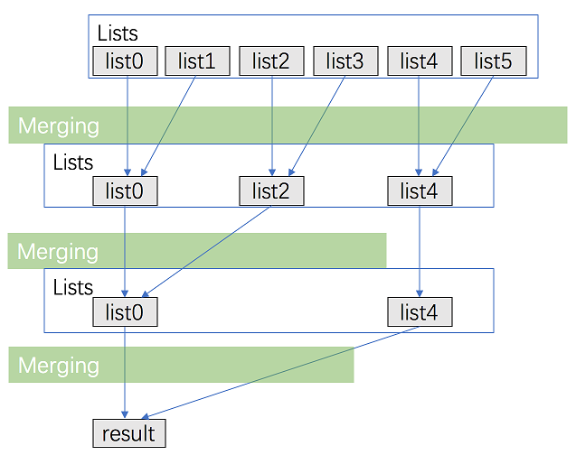

# [23. Merge k Sorted Lists](https://leetcode.com/problems/merge-k-sorted-lists/)

# 思路

将k个排好序的链表合并成一个大的有序链表。

## 思路一

最好想的就是维护一个堆（priority_queue）或者红黑树（multiset或者multimap）的数据结构。首先把k个链表的首元素都加入其中，然后每次取出最小的那个元素加入最终结果的链表中，然后把取出元素所在链表的下一个元素再加入结构中，以此类推，直到结构中没有元素了。


设所有元素个数为N，时间复杂度O(Nlogk)，空间复杂度O(k)

## 思路二

另一个思路就是外排序，即k路归并排序的思想，如下图所示

<div align=center>

</div>

由于每次归并时间复杂度是线性的，所以每一轮归并时间均为O(N)，而需要 logk 轮归并，所以时间复杂度O(Nlogk)。

空间复杂度O(1)

# C++
## 思路一、使用priority_queue
**注意学习如何自定义compare类**
``` C++
// 默认为最大堆, 所以需要自定义compare类使成为最小堆
struct compare {
    bool operator()(const ListNode* p1, const ListNode* p2) {
        return p1 -> val > p2 -> val;
    }
};

class Solution {
public:
    ListNode* mergeKLists(vector<ListNode*>& lists) {
        priority_queue<ListNode*, vector<ListNode*>, compare>min_heap;
        
        for(int i = 0; i < lists.size(); i++)
            if(lists[i]) min_heap.push(lists[i]);
        
        if(min_heap.empty()) return NULL;
    
        ListNode *head = min_heap.top(), *p = head;
        min_heap.pop();
        if(p -> next) min_heap.push(p -> next);
        while(!min_heap.empty()){
            p -> next = min_heap.top(); min_heap.pop();
            p = p -> next;
            if(p -> next) min_heap.push(p -> next);
        }
        return head;
    }
};
```

## 思路一、使用multimap
**注意multimap插入时需传入一个{key, value}的pair**
``` C++
class Solution {
public:
    ListNode* mergeKLists(vector<ListNode*>& lists) {
        multimap<int, ListNode*>mp;
        for(int i = 0; i < lists.size(); i++)
            if(lists[i]) mp.insert({lists[i] -> val, lists[i]});
        
        if(mp.empty()) return NULL;
    
        ListNode *head = mp.begin() -> second, *p = head;
        mp.erase(mp.begin());
        if(p -> next) mp.insert({p -> next -> val, p -> next});
        while(!mp.empty()){
            p -> next = mp.begin() -> second; 
            mp.erase(mp.begin());
            p = p -> next;
            if(p -> next) mp.insert({p -> next-> val, p -> next});
        }
        return head;
    }
};
```

## 思路二
``` C++
class Solution {
private:
    ListNode* mergeTwoLists(ListNode* l1, ListNode* l2) {
        /*copy from 21. Merge Two Sorted Lists  */
        ListNode *res = new ListNode(0);
        ListNode *pre = res;
        while(l1 && l2){
            if(l1 -> val <= l2 -> val){
                pre -> next = l1;
                l1 = l1 -> next;
            } 
            else{
                pre -> next = l2;
                l2  = l2 -> next;
            }
            pre = pre -> next;
        }
        
        if(l1) pre -> next = l1;
        else pre -> next = l2;
        
        ListNode *head = res;
        res = head -> next;
        head -> next = NULL;
        delete head;
        return res;
    }
    
public:
    ListNode* mergeKLists(vector<ListNode*>& lists) {
        int n = lists.size();
        if(!n) return NULL;
        
        int interval = 1;
        while(interval < n){
            for(int i = 0; i < n - interval; i += (2 * interval))
                lists[i] = mergeTwoLists(lists[i], lists[i+interval]);
            
            interval*=2;
        }
        return lists[0];
    }
};
```