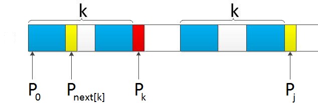
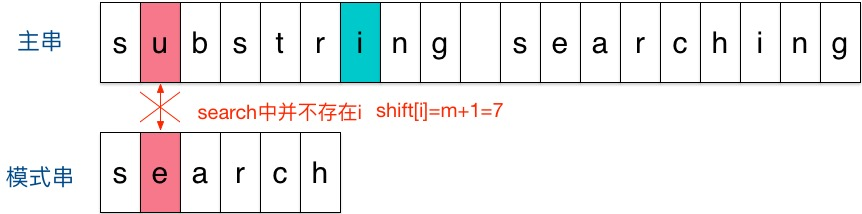
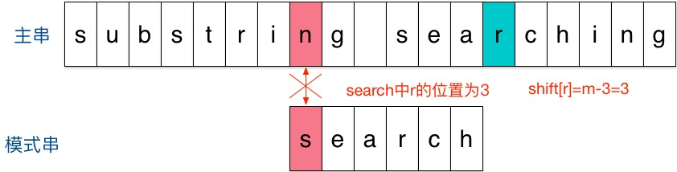
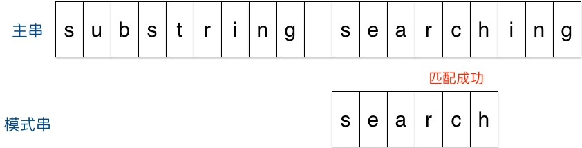

# [28. Implement strStr()](https://leetcode.com/problems/implement-strstr/)

# 思路

字符串匹配。

## 思路一、暴力

用一个两层循环暴力匹配，可能测试样例比较弱，所以亲测时间并不慢（8ms）。

时间复杂度O(mn)，空间复杂度O(1)

## 思路二、KMP

字符串匹配经典的解法应该就是KMP（Knuth-Morris-Pratt）算法了，与暴力匹配（每次失配时，回到模式串开头重新匹配）不同，**KMP的核心思想就是每次失配时，根据模式串的特点，将模式串回退到适当的位置。**


先来定义next数组:

* `next[i]`表示模式串中前i个字符串（即P[0,...,i-1]）中相同前缀后缀的最大长度，`next[0]`和`next[1]`固定为-1和0。

举例：
* 若`next[5] = 2`，则说明`P[0,1] == P[3,4]`
* 又如`abcabd`的`next = {-1, 0, 0, 0, 1, 2}`


若某个模式串P如下图所示，若匹配到`P[k]`与待匹配的字符串`S[i]`失配，即`P[k]!=S[i]`；对于暴力匹配来说，我们需要从头开始匹配P和S，即从`P[0]`开始匹配；但是由于我们知道了蓝色部分的子串是相等的，所以我们可以从`P[next[k]]`开始匹配。

<div align=center>

</div>
<div align=center>一个模式串P的示意图，颜色相同的子串相等</div>


所以问题就是如何求next数组，仔细分析一下下图也很简单，如果我们求得了`next[0,...,j]`，

* 令`k = next[j]`, 如果`P[j] == P[k]`，那么`next[j+1] = k + 1`;
* 否则，令`k = next[k]`，重复上述过程；

此外，next还可以优化，因为如果`P[k] == P[next[k]]`，那么如果`P[k]`与待匹配的字符串`S[i]`失配，那么`P[next[k]]`肯定还是与`S[i]`失配，所以如果`P[k] == P[next[k]]`，我们可更新 `next[k] = next[next[k]]`。

关于KMP比较详细的介绍可参考[从头到尾彻底理解KMP](https://blog.csdn.net/v_july_v/article/details/7041827)。

KMP算法时间复杂度为O(m+n)，空间复杂度为O(n)，其中n为模式串的长度

## 思路三、Sunday

关于字符串匹配还有比KMP更好理解的算法，叫做Sunday算法。

参考[字符串匹配——Sunday算法](https://blog.csdn.net/q547550831/article/details/51860017)，举个例子来说明：

* 刚开始时，把模式串与主串左边对齐：
<div>

</div>

* 结果发现在第2个字符处发现不匹配，不匹配时**关注主串中参加匹配的最末位字符的下一位字符**，即标粗的字符 i，因为模式串search中并不存在i，所以模式串直接跳过一大片，向右移动位数 = 匹配串长度 + 1 = 6 + 1 = 7，从 i 之后的那个字符（即字符n）开始下一步的匹配，如下图
<div>

</div>

* 结果第一个字符就不匹配，再看主串中参加匹配的最末位字符的下一位字符，是 r，它在模式串位于倒数第3位（如果模式串有多个 r 我们应该以最后一个为准，因为那样移动次数较少才不会错过），于是把模式串向右移动3位（m - 3 = 6 - 3 = r 到模式串末尾的距离 + 1 = 2 + 1 =3），使两个 r 对齐，如下
<div>

</div>

* 匹配成功。

可见我们需要一个数组，记录了某个字符在模式串中最后一次出现的位置到末尾的距离，由于ASCII用0-127来编码字符，所以我们可以用一个长度为128的数组，即代码中的move数组。

平均复杂度O(m+n)，move数组的大小时固定的，所以可认为空间复杂度O(1)

最坏情况下，时间复杂度为O(mn)，例如主串为baaaabaaaabaaaabaaaa而模式串为aaaaa。

## 思路四、Boyer-Moore

实际应用最多字符串匹配算法貌似是Boyer-Moore算法，有兴趣的可以去看看：
* [字符串匹配的Boyer-Moore算法](https://www.ruanyifeng.com/blog/2013/05/boyer-moore_string_search_algorithm.html)；
* [BM算法和Sunday快速字符串匹配算法](https://www.cnblogs.com/Philip-Tell-Truth/p/5185267.html)。

# C++
## 思路一
``` C++
class Solution {
public:
    int strStr(string haystack, string needle) {
        if (needle.empty()) return 0;
        int m = haystack.size(), n = needle.size();
        if (m < n) return -1;
        for (int i = 0; i <= m - n; ++i) {
            int j = 0;
            for (j = 0; j < n; ++j) {
                if (haystack[i + j] != needle[j]) break;
            }
            if (j == n) return i;
        }
        return -1;
    }
};
```


## 思路二

``` C++
class Solution {
private:
    vector<int>compute_next(const string& pattern){
        int pn = pattern.size();
        vector<int>next(pn, 0); next[0] = -1;
        
        for(int i = 2; i < pn; i++){
            int j = next[i-1];
            while(j >= 0 && pattern[j] != pattern[i-1]) j = next[j];
            next[i] = j + 1;
        }
        
        // // next数组优化
        // for(int i = 2; i < pn; i++){ 
        //     int t1 = i, t2 = next[i];
        //     while(t2 >= 0 && pattern[t1] == pattern[t2]){
        //         t1 = t2;
        //         t2 = next[t2];
        //     }
        //     next[i] = t2;
        // }
        return next;
    }
public:
    int strStr(string haystack, string needle) {
        int sn = haystack.size(), pn = needle.size();
        if(!pn) return 0;
        if(sn < pn) return -1;
        vector<int>next = compute_next(needle);        
        
        int i = 0, j = 0;
        while(i < sn){
            if(j == -1 || haystack[i] == needle[j]){
                i++;
                j++;
                if(j == pn) return i - pn;
            }
            else j = next[j];
        }   
        
        return -1;
    }
};
```

## 思路三
``` C++
class Solution {
public:
    int strStr(string haystack, string needle) {
        int sn = haystack.size(), pn = needle.size();
        if(!pn) return 0;
        if(sn < pn) return -1;
        
        vector<int>move(128, pn + 1);
        for(int i = 0; i < pn; i++)
            move[needle[i]] = pn - i;
        
        int i = 0; 
        while(i <= sn - pn){
            int j = 0;
            while(haystack[i + j] == needle[j])
                if(++j == pn) return i;
            
            i += move[haystack[i + pn]];
        }
        return -1;
    }
};
```