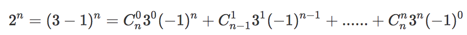

# [342. Power of Four](https://leetcode.com/problems/power-of-four/description/)
# 思路
判断一个整数是否是4的幂，要求不能用循环或者递归。   
## 思路一
我们知道4的幂有1、4、16、64......，将其转换为二进制有:
* 1 ->  00000001
* 4 ->  00000100
* 16 -> 00010000
* ........ 

可以发现一个正数是4的幂的充要条件是: 
* 1、其二进制只有一个1;
* 2、且1的位置从低位起只能是位于0、2、4...(即全为偶数)处。 

第1个条件等价于去掉最后的那个1后整个数变为0，即 `num & (num - 1) == 0`；(**注意学习这种去掉二进制最后一个1的方法**)   
第2个条件等价于 `(num | mask) == mask`, 其中`mask = 0b01010101010101010101010101010101`。

## 思路二
还是基于思路一的两个条件，我们知道如果只满足思路一的条件1的数可能是`2^n`也可能是`4^n`, 怎样排除掉`2^n`呢？   
我们知道：   
<div align=center>

</div>

所以, 

* 1.n为偶数时既是2的幂也是4的幂，此时`(-1)^n==1`所以`(2^n - 1）% 3==0`;
* 2.n为奇数是只是2的幂但不是4的幂, 此时`(-1)^n=-1`所以`(2^n - 1）% 3==1`；

故可以用`(2^n-1）% 3`是否等于0来等价判断思路一的条件2, 将2的幂和4的幂区分开。
# C++
## 思路一
``` C++
class Solution {
public:
    bool isPowerOfFour(int num) {
        int mask = 0b01010101010101010101010101010101;
        return num > 0 && (num & (num - 1)) == 0 && (num | mask) == mask;
    }
};
```
## 思路二
``` C++
class Solution {
public:
    bool isPowerOfFour(int num) {
        return num > 0 && (num & (num - 1)) == 0 && (num - 1) % 3 == 0;
    }
};
```
