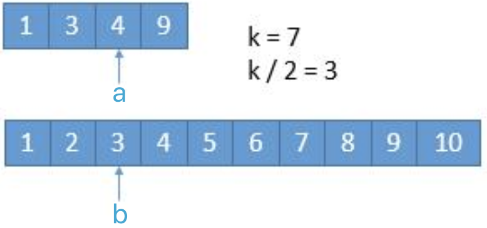
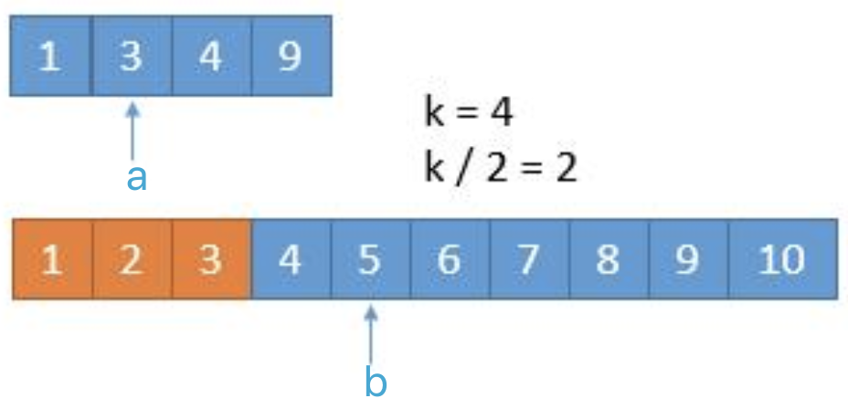
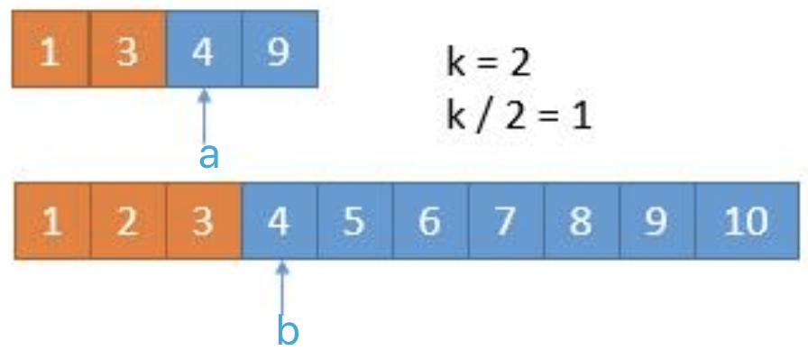
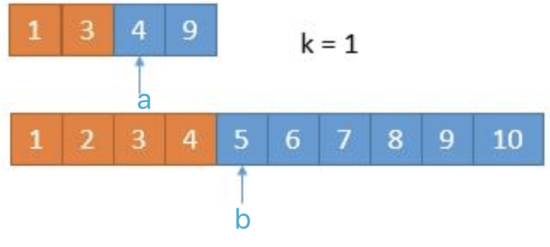

# [4. Median of Two Sorted Arrays](https://leetcode.com/problems/median-of-two-sorted-arrays/)

# 思路

给定两个（递增）排好序的数组，求所有数字的中位数。
要求时间复杂度为O(log(m+n))，所以从头到尾合并两个数组直到遇到中位数的方式不可取，因为这样复杂度为O(m+n)。

## 思路一

核心思想：**按照中位数的定义将所有元素划分成两个大小相等（或差一）的集合。**

排好序+对数复杂度这两个条件就相当于告诉我们要用二分的思路。

先看看中位数的定义：在统计学中，中位数用于
* 将集合划分为两个相等长度的子集，
* 且一个子集总是大于另一个子集。

设给的两个数组分别是A和B，我们先随机将A划分成两个部分：

```
      left_A             |           right_A
A[0], A[1], ..., A[i-1]  |  A[i], A[i+1], ..., A[m-1]
```
所以 i 有m+1中可能，即`0,1,...,m`。

同理，可将B分成两个部分：
```
     left_B              |        right_B
B[0], B[1], ..., B[j-1]  |  B[j], B[j+1], ..., B[n-1]
```
j 可以是`0,1,...,n`。

我们 left_A 和 left_B 放入同一个集合，将 right_A 和 right_B 放入另外一个集合：
```
      left_part          |        right_part
A[0], A[1], ..., A[i-1]  |  A[i], A[i+1], ..., A[m-1]
B[0], B[1], ..., B[j-1]  |  B[j], B[j+1], ..., B[n-1]
```

由于我们想求中位数，所以需要满足
```
1. len(left_part) == len(right_part) (或者相差1, 当m+n为奇数的时候)
2. max(left_part) <= min(right_part)  <==> B[j-1] <= A[i] && A[i-1] <= B[j]
```
对应于中位数的定义中的两个条件。

为了满足第一个条件，我们规定
```
若 m+n = 2N,   则 len(left_part) == N
若 m+n = 2N+1, 则 len(left_part) == N + 1
所以这里的 N = (m+n+1)/2

又因为 len(left_part) == i + j
所以 j = N - i
```

为了使`j = N - i`在区间[0, n]内，我们规定**m <= n**。

第一个条件始终满足后，我们就可以利用第二个条件进行二分了，即在 [0, m] 中进行二分查找，使找到的 i 满足:
```
B[j-1] <= A[i] && A[i-1] <= B[j], where j = N - i
```

设初始时`min_i = 0, max_i = m`，则算法步骤就是
1. 设 `i = (min_i + max_i) / 2, j = N - i`;
2. 此时有三种情况:
    * 若`B[j-1] <= A[i] && A[i-1] <= B[j]`, 即找到了所需的i，停止搜索；
    * 若`B[j-1] > A[i]`, 意味着 A[i] 太小 B[j-1] 太大，那么我们需增大 i 。因为只有 i 增大时（j 会跟着减小）`B[j-1] <= A[i]`才可能成立。所以，更新`min_i = i+1`, 然后回到步骤1.
    * 若`A[i-1] > B[j]`, 意味着 A[i-1] 太大 B[j] 太小。所以，更新`max_i = i-1`, 然后回到步骤1.

上述算法步骤中我们没有考虑边界条件，写代码时需要仔细考虑，而且还需要考虑 m+n 为奇偶时的不同情况：
* 若为偶数，所以`len(left_part) == N`且`len(right_part) == N`，所以最终的中位数为`(max_of_left + min_of_right) / 2`。
* 若为奇数，所以`len(left_part) == N+1`且`len(right_part) == N`，所以最终的中位数为`max_of_left`。

时间复杂度O(log(min(m, n)))，空间复杂度O(1)

[参考链接](https://leetcode-cn.com/problems/median-of-two-sorted-arrays/solution/xun-zhao-liang-ge-you-xu-shu-zu-de-zhong-wei-shu-b/)

## 思路二、求第k小的数

核心思想：**每次去掉k/2个数，然后递归求第(k - k/2)小的数**

此题更一般的问法是求第k小的数（设k从1编号），我们设为target。

我们设两个数组的第 k/2 大的数分别为 a 和 b，
* 若 a < b，那么target肯定比 a 大，所以我们可以排除掉第一个数组的前 k/2 个数，我们继续在剩下的元素中找递归找第 k - k/2 大的元素；
* 否则，即 a >= b，那么target肯定不比 b 小，所以我们可以排除掉第二个数组的前 k/2 个数，我们继续在剩下的元素中找递归找第 k - k/2 大的元素；

举个例子来说明，假设题目 k = 7：

<div>

</div>

可见`a > b`，那么第二个数组的前三个元素可以去除掉了（下图橙色表示去掉的元素），

<div>

</div>

现在 k = 4，k/2 = 2，此时的`a < b`，那么应该去掉第一个数组的前两个元素，

<div>

</div>

一次类推直到k = 1：

<div>

</div>

此时就可以直接返回结果了，结果是`min(a, b)`。


需要注意的是有时候数组的元素不够 k/2 个，所以究竟去掉了多少个元素需要视实际情况而定。

时间复杂度：每次减少 k/2 个元素，所以时间复杂度是 O(log(k)，而 k=(m+n)/2，所以最终的复杂也就是 O(log(m+n))。

空间复杂度：虽然我们用到了递归，但是可以看到这个递归属于尾递归（即递归调用在函数最末尾），所以编译器不需要不停地堆栈，所以空间复杂度为 O(1)。


[参考链接](https://leetcode-cn.com/problems/median-of-two-sorted-arrays/solution/xiang-xi-tong-su-de-si-lu-fen-xi-duo-jie-fa-by-w-2/)


# C++

## 思路一
``` C++
class Solution {
public:
    double findMedianSortedArrays(vector<int>& nums1, vector<int>& nums2) {
        int m = nums1.size(), n = nums2.size();
        if(m > n) return findMedianSortedArrays(nums2, nums1);
        
        // m <= n
        
        int min_i(0), max_i(m), i, j;
        const int LEFT_PARTS_NUM = (m + n + 1) / 2;
        while(min_i <= max_i){
            i = (min_i + max_i) / 2;
            j = LEFT_PARTS_NUM - i;
            
            if(i < m && nums1[i] < nums2[j - 1]) min_i = i + 1;
            else if(i > 0 && nums1[i-1] > nums2[j]) max_i = i - 1;
            else{ // find it
                double max_of_left = max(i > 0 ? nums1[i-1]: INT_MIN, 
                                         j > 0 ? nums2[j-1]: INT_MIN);
                
                if((m + n) & 1) return max_of_left;
                double min_of_right = min(i < m ? nums1[i]: INT_MAX, 
                                          j < n ? nums2[j]: INT_MAX);
                return 0.5 * (max_of_left + min_of_right);
            }
        }
        return -1; // 永远不会执行
    }
};
```

## 思路二
``` C++
class Solution {
private:
    // 从两个有序数组里面找到第k小的元素, k从1开始
    double helper(const vector<int>& nums1, const vector<int>& nums2,
                  int start1, int start2, int k){
        if(k == 1) return min(start1 < nums1.size() ? nums1[start1] : INT_MAX,
                              start2 < nums2.size() ? nums2[start2] : INT_MAX);
        
        // 有一个数组为空
        if(start1 >= nums1.size()) return (double)nums2[start2 + k - 1];
        else if(start2 >= nums2.size()) return (double)nums1[start1 + k - 1];
        
        int i = min(start1 + k / 2, (int)nums1.size());
        int j = min(start2 + k / 2, (int)nums2.size());
        
        if(nums1[i - 1] < nums2[j - 1]) 
            return helper(nums1, nums2, i, start2, k - i + start1);
        else 
            return helper(nums1, nums2, start1, j, k - j + start2);
    }
public:
    double findMedianSortedArrays(vector<int>& nums1, vector<int>& nums2) {
        int m = nums1.size(), n = nums2.size();
        double mid1 = helper(nums1, nums2, 0, 0, (m + n + 1) >> 1);
        if((m + n) & 1) return mid1;
        else return 0.5 * (mid1 + helper(nums1, nums2, 0, 0, (m + n + 2) >> 1));
    }
};
```