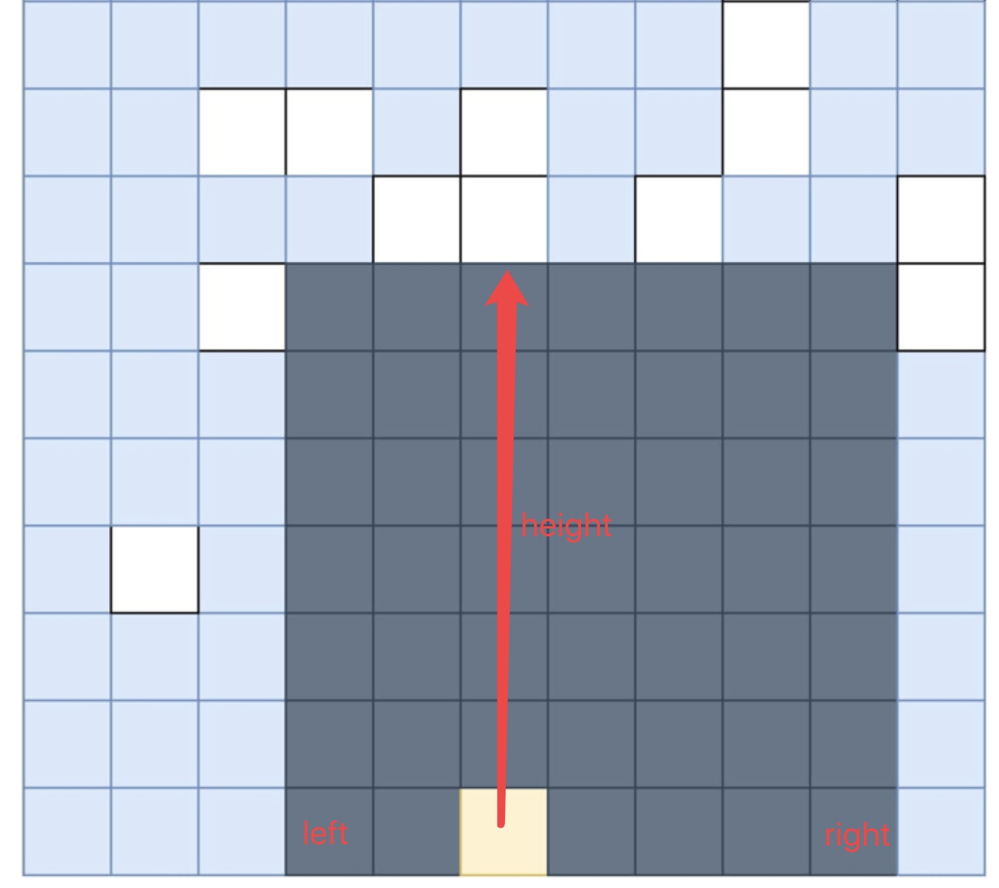

# [85. Maximal Rectangle](https://leetcode.com/problems/maximal-rectangle/)

# 思路

## 思路一

对于二维矩阵的第 i 行，这一行及上面的部分可以看成是一个直方图，而在直方图里求最大矩形即[84. Largest Rectangle in Histogram](https://leetcode.com/problems/largest-rectangle-in-histogram/)，我们可以用单调栈在线性复杂度内求解84题，详见[84题解](84.%20Largest%20Rectangle%20in%20Histogram.md)。

所以对于此题，我们只需要开辟一个表示直方图的一维数组`heights`，然后对于每一行，建立直方图，然后再用84题思路（代码中采用的是[84题解思路二](84.%20Largest%20Rectangle%20in%20Histogram.md)）进行求解。我们可以根据上一行的直方图`heights`在线性时间复杂度内建立当前行的直方图`heights`：
* 如果`matrix[i][j] == '0'`，则`heights[j] = 0`;
* 否则，`heights[j] += 1`;

时间复杂度O(MN)，空间复杂度O(N)；其中M和N分别为高和宽。

## 思路二

对于每个点，我们会通过以下步骤计算出一个矩形：

* 不断向上方遍历，直到遇到“0”，以此找到矩形的高度。
* 向左右两边扩展，直到无法容纳这个高度。

例如，找到黄色点对应的矩形（[图片来源](https://leetcode-cn.com/problems/maximal-rectangle/solution/zui-da-ju-xing-by-leetcode/)）：

<div align=center>

</div>

如果知道了高height和左右边界left、right，这样就可以计算出面积等于`height * (right - left + 1)`。

求height的方法和思路一是一样的，下面讨论求left和right。

设第`i-1`行的left和right已经求出来了分别为`old_left`和`old_right`，当前点为`matrix[i][j]`为`"1"`，
1. 求left
设`left_zero`为`matrix[i][j]`向左看第一个0的列坐标，那么易知`new_left[j] = max(old_left[j], left_zero + 1)`；

2. 求right
类似的，设`right_zero`为`matrix[i][j]`向右看第一个0的列坐标，那么易知`new_right[j] = min(old_right[j], right_zero - 1)`。

所以我们可以开辟一个一维数组`left`和`right`，然后对于每一行：从左往后更新`left`，从右往左更新`right`（就是动态规划的滚动数组思路）。

时间复杂度O(MN)，空间复杂度O(N)；其中M和N分别为高和宽。


# C++
## 思路一
``` C++
class Solution {
public:
    int maximalRectangle(vector<vector<char>>& matrix) {
        int m = matrix.size(); 
        if(!m) return 0;
        int n = matrix[0].size();
        
        int max_res = 0, res = 0;
        vector<int>heights(n + 1, 0); // 注意大小是n+1, 见84题解
        for(int i = 0; i < m; i++){
            for(int j = 0; j < n; j++){
                if(matrix[i][j] == '0') heights[j] = 0;
                else heights[j] += 1;
            }
            
            // 下面几行基本就是84题解
            stack<int>ascend_stk; res = 0;
            for(int k = 0; k <= n; k++){
                while(!ascend_stk.empty() && heights[ascend_stk.top()] >= heights[k]){
                    int height = heights[ascend_stk.top()]; ascend_stk.pop();
                    int width = ascend_stk.empty() ? k : k - 1 - ascend_stk.top();
                    res = max(res, height * width);
                }
                ascend_stk.push(k);
            }
            
            max_res = max(res, max_res);
        }
        return max_res;
    }
};
```

## 思路二
``` C++
class Solution {
public:
    int maximalRectangle(vector<vector<char>>& matrix) {
        int m = matrix.size(); 
        if(!m) return 0;
        int n = matrix[0].size();
        
        int res = 0, left_zero, right_zero;
        vector<int>heights(n, 0), left(n, -1), right(n, n);
        for(int i = 0; i < m; i++){
            // 更新高度
            for(int j = 0; j < n; j++)
                if(matrix[i][j] == '0') heights[j] = 0;
                else heights[j] += 1;
            
            // 更新左边界(可以和上面更新高度合在一个循环内)
            left_zero = -1;
            for(int j = 0; j < n; j++){
                if(matrix[i][j] == '0') {
                    left_zero = j;
                    left[j] = -1;
                }
                else left[j] = max(left_zero + 1, left[j]);
            }
            
            // 更新右边界
            right_zero = n;
            for(int j = n-1; j >= 0; j--){ // 逆向循环!!!
                if(matrix[i][j] == '0') {
                    right_zero = j;
                    right[j] = n;
                }
                else right[j] = min(right_zero - 1, right[j]);
                res = max(res, heights[j] * (right[j] - left[j] + 1));
            }
        }
        
        return res;
    }
};
```